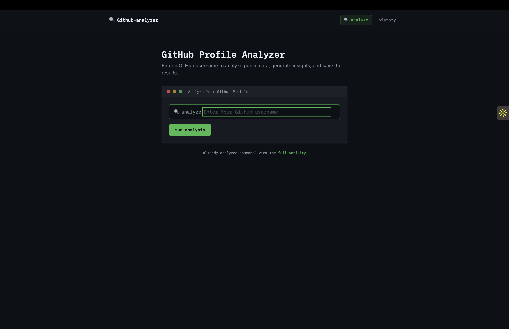
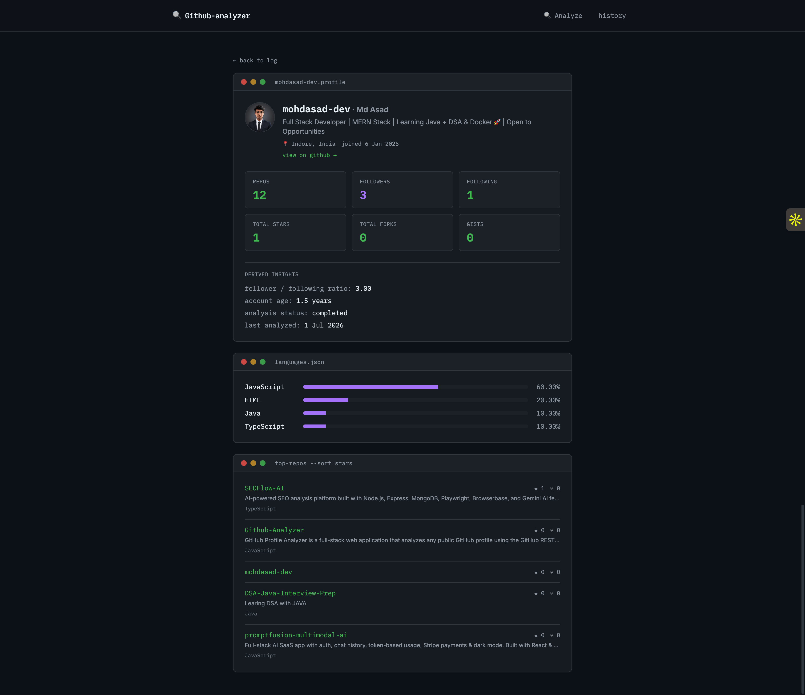

# 🚀 GitHub Profile Analyzer

A full-stack GitHub Profile Analyzer built with **React**, **Node.js**, **Express.js**, **MySQL**, and the **GitHub REST API**. The application analyzes any public GitHub profile, generates developer insights, and stores the analysis in a MySQL database for future reference.


---

# 🌐 Live Demo

**Frontend:**  
👉 https://github-analyzer-uzc4.vercel.app

---

# 📂 Source Code

👉 https://github.com/mohdasad-dev/Github-Analyzer

---

# 📸 Screenshots

## 🏠 Home Page



---

## 📊 Analysis Result



---

# 📌 Overview

GitHub Profile Analyzer helps developers, recruiters, and organizations quickly analyze any public GitHub profile.

Instead of manually browsing GitHub, users simply enter a GitHub username to receive detailed information including repositories, programming languages, stars, forks, followers, repository analytics, and other useful insights.

The application follows a clean client-server architecture where the React frontend communicates with a RESTful Express backend. The backend fetches data from the GitHub REST API, processes repository statistics, calculates developer insights, stores the information in MySQL, and returns structured JSON responses.

---

# 💡 Why this Project?

This project demonstrates real-world backend development by integrating a third-party API, processing large datasets, storing structured information in MySQL, and exposing RESTful APIs.

Although the assignment focused on backend development, a modern React frontend was added to provide an intuitive user interface and demonstrate full-stack development skills.

---

# ✨ Features

## 🎨 Frontend

- 🔍 Search any public GitHub username
- 👤 Developer profile page
- 📂 Repository listing
- 📊 Language distribution
- ⭐ Repository statistics
- 📱 Fully responsive UI
- ⚡ Fast API integration
- ⏳ Loading animations
- ❌ Error handling
- 📜 Analysis history page

---

## ⚙ Backend

### GitHub API Integration

- Fetch GitHub profile
- Fetch repositories
- Analyze repository data
- GitHub API rate limit endpoint

### Developer Analytics

- Total repositories
- Total stars
- Total forks
- Average stars
- Most starred repository
- Most forked repository
- Followers
- Following
- Public gists
- Programming language distribution
- Account age
- Repository insights

### Database Storage

Stores:

- GitHub Profile
- Repository Information
- Language Analysis
- Analysis History
- API Activity Logs

### Validation & Security

- Joi validation
- Username validation
- Input sanitization
- Helmet
- CORS
- Rate Limiting
- Centralized Error Handling

---

# 🛠 Tech Stack

## Frontend

- React
- React Router
- Tailwind CSS
- Vite

## Backend

- Node.js
- Express.js
- MySQL
- GitHub REST API
- Axios
- Joi
- dotenv
- mysql2

---

# 🗄 Database Schema

## profiles

Stores

- GitHub ID
- Username
- Name
- Bio
- Avatar URL
- Profile URL
- Followers
- Following
- Public Repositories
- Public Gists
- Company
- Location
- Email
- Blog
- Hireable Status
- Account Created Date

---

## user_repositories

Stores

- Repository Name
- Repository URL
- Description
- Language
- Stars
- Forks
- Watchers
- Open Issues
- Created Date
- Updated Date
- Last Push Date

---

## analysis_history

Stores

- Repository Count
- Followers
- Following
- Gists
- Analysis Timestamp

---

## api_logs

Stores

- Username
- Endpoint
- Status Code
- Response Time
- Timestamp

---

# 📂 Project Structure

```text
Github-Analyzer
│
├── frontend
│   ├── src
│   ├── components
│   ├── pages
│   ├── api.js
│   └── ...
│
├── backend
│   ├── config
│   ├── middleware
│   ├── routes
│   ├── services
│   ├── database.sql
│   └── server.js
│
├── assets
│   ├── home.png
│   └── Result.png
│
└── README.md
```

---

# 🔄 System Architecture

```text
Frontend (React)

        │

        ▼

Express REST API

        │

        ▼

GitHub REST API

        │

        ▼

Repository Analysis

        │

        ▼

Developer Metrics Calculation

        │

        ▼

MySQL Database

        │

        ▼

JSON Response

        │

        ▼

Frontend Dashboard
```

---

# 📈 API Workflow

```text
Enter Username

      │

      ▼

POST /api/analyze

      │

      ▼

Fetch GitHub Profile

      │

      ▼

Fetch User Repositories

      │

      ▼

Calculate Developer Metrics

      │

      ▼

Store Analysis in MySQL

      │

      ▼

Return JSON Response

      │

      ▼

Display Dashboard
```

---

# 📡 REST API Endpoints

| Method | Endpoint | Description |
|---------|----------|-------------|
| POST | `/api/analyze` | Analyze GitHub Profile |
| GET | `/api/profiles` | Get All Profiles |
| GET | `/api/profile/:username` | Get Profile Details |
| GET | `/api/profile/:username/repositories` | Get User Repositories |
| GET | `/api/profile/:username/languages` | Language Distribution |
| GET | `/api/search?q=username` | Search Profiles |
| GET | `/api/statistics` | Overall Statistics |
| GET | `/api/rate-limit` | GitHub API Rate Limit |
| GET | `/health` | Health Check |

---

# 🚀 Installation

## Clone Repository

```bash
git clone https://github.com/mohdasad-dev/Github-Analyzer.git
```

---

## Navigate

```bash
cd Github-Analyzer
```

---

## Install Dependencies

```bash
npm install
```

---

## Configure Environment Variables

Create a `.env` file.

```env
PORT=5001

DB_HOST=localhost
DB_USER=root
DB_PASSWORD=your_password
DB_NAME=github_analyzer

GITHUB_TOKEN=your_github_token
```

---

## Create Database

```bash
mysql -u root < database.sql
```

---

## Start Development Server

```bash
npm run dev
```

---

# 🚀 Deployment

Frontend

- Vercel

Backend

- Vercel

Database

- MySQL

---

# 📊 Example API Response

```json
{
  "success": true,
  "data": {
    "profile": {},
    "repositories": [],
    "analysisHistory": []
  }
}
```

---

# 📈 Skills Demonstrated

- REST API Development
- Express.js
- Node.js
- MySQL Database Design
- Third-party API Integration
- GitHub REST API
- Service Layer Architecture
- Clean Code Principles
- Error Handling
- Validation
- Authentication Ready Design
- Data Analytics
- Full Stack Development
- Responsive UI Development

---

# 🚀 Future Improvements

- JWT Authentication
- GitHub OAuth Login
- Redis Caching
- Docker Support
- Swagger Documentation
- Charts & Graphs
- Export PDF Reports
- CSV Export
- Email Notifications
- Unit Testing
- CI/CD Pipeline

---

# 🌍 Project Links

## 💻 Live Website

https://github-analyzer-uzc4.vercel.app

## 📂 GitHub Repository

https://github.com/mohdasad-dev/Github-Analyzer.git

---

# 🙏 Acknowledgements

- GitHub REST API
- React
- Express.js
- Node.js
- MySQL
- Tailwind CSS
- Vite

---

# 👨‍💻 Author

**Md Asad**

Full Stack Developer | MERN Stack Developer

### GitHub

https://github.com/mohdasad-dev

### LinkedIn

https://www.linkedin.com/in/md-asad-dev/

---

# ⭐ Support

If you found this project helpful, consider giving it a ⭐ on GitHub.

---

# 📄 License

This project is licensed under the MIT License.
